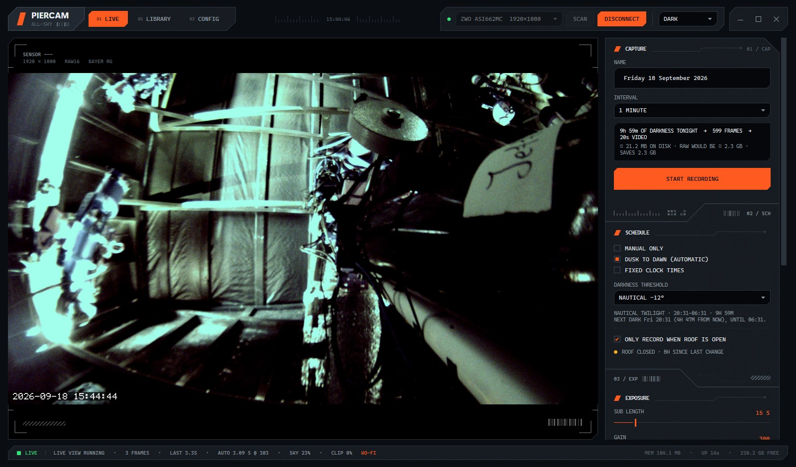
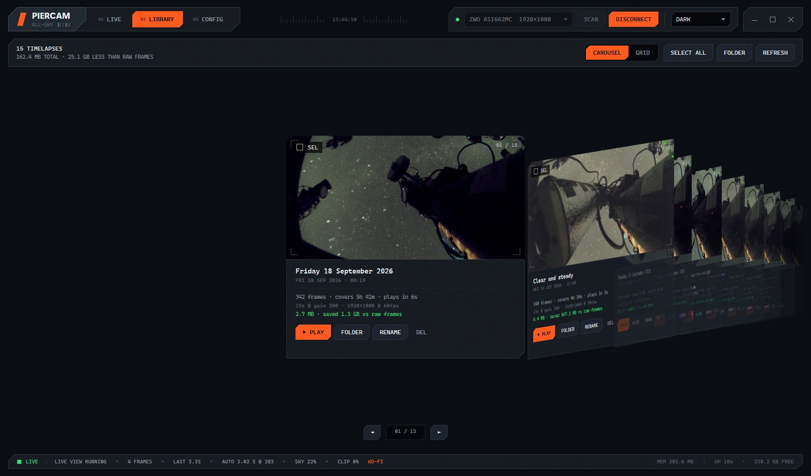

<div align="center">

# PierCam

**Dusk-to-dawn timelapse recorder for observatory pier cameras.**

Live view · scheduled all-night recording straight to video · a library to watch it back

[](https://github.com/YoruDev-Ryland/PierCam/actions/workflows/build.yml)
[](LICENSE)
[](https://github.com/YoruDev-Ryland/PierCam/releases/latest)



</div>

## Why

Capture software writes one image per frame. A ten-hour night at a 15-second cadence is a few
thousand stills and the best part of ten gigabytes, and it has to be encoded afterwards.

PierCam encodes as it captures. Each exposure is debayered, stretched and pushed straight into
H.264 — one file, growing through the night, no post-processing pass, no folder of stills.

| One real 2,374-frame night, 1080p | Size |
|---|---:|
| Raw PNG frames | 9.17 GB |
| CRF 20, no noise reduction | 677 MB |
| **CRF 26 + noise reduction** (default) | **92.5 MB** |

Sensor noise is different in every frame, so the encoder can't predict it and spends most of its
bitrate there. Denoising roughly halves the file *and* looks better than the original, because
what it removes is noise rather than detail.

## Features

- **Schedules on real astronomical twilight** for your site, so the recording window moves with
  the seasons on its own. Fixed clock times if you'd rather.
- **Roof-aware.** Gate recording on an observatory roof status file: starts when the roof opens,
  keeps filming for a few minutes after it shuts so the closing roof is actually in the video,
  then holds and resumes into the *same* file if it reopens. One night, one video.
- **Auto-exposure ramp** for twilight, and an auto-stretch that cancels light-pollution cast and
  follows the sky slowly rather than flickering frame to frame.
- **Target marker.** A ring on the pier cam view where the telescope is pointing, read live from
  N.I.N.A.'s Advanced API. The camera calibrates itself from the stars in nights it has already
  recorded, with no manual star-picking. Optionally burned into recordings, with a clean copy
  kept alongside.
- **Library** with a carousel and a grid, in-app playback, and batch downscaling of old nights.
- **Built to stay light.** Nothing allocates per frame, no frame history, one reused bitmap. The
  status bar shows live memory and uptime so you can check rather than take my word for it.
- **Three palettes**, including a red-only Night mode that doesn't undo your dark adaptation.
- Every tuning value is settable and persisted. Nothing is compiled in.

<div align="center">
  
</div>

## Install

Grab the latest [release](https://github.com/YoruDev-Ryland/PierCam/releases/latest):

- **`PierCam-<version>-Setup.exe`** — installs per-user, no administrator needed.
- **`PierCam-<version>-win-x64.zip`** — portable; unzip and run.

The .NET runtime is bundled, so there's nothing else to install. The build is unsigned, so
Windows will warn about an unknown publisher.

**You'll also need ZWO's driver package.** `ASICamera2.dll` isn't shipped — PierCam finds the
one already on the machine, so ZWO driver updates help it rather than break it. If Config shows
`ASI SDK  not loaded`, install [ASIStudio](https://www.zwoastro.com/downloads/) and restart.

Requires Windows 10 1809 or later, 64-bit, and a ZWO ASI camera. Developed against an ASI662MC.

## First run

On the Config page: pick your camera, set the library folder, set your site coordinates (or
import them from N.I.N.A.). If your observatory publishes a roof status file, point Site & Roof
at it — otherwise set a schedule. Settings live in `%AppData%\PierCam`.

## Build

```powershell
dotnet build -c Release
```

`.\publish.ps1` produces a self-contained drop in `dist\`; add `-Installer` to build the setup
executable too, which needs [Inno Setup](https://jrsoftware.org/isinfo.php).

`ffmpeg.exe` isn't in the repository — see [tools/README.md](tools/README.md) for what to put
there. PierCam runs it as a separate process rather than linking against it.

Pushing a `v*` tag builds and publishes a release automatically.

## Licence

[GPL-3.0-or-later](LICENSE). FFmpeg is redistributed in release downloads under its own GPL
terms; the ZWO SDK is not redistributed at all.
